令和5年度　　　卒業研究論文

複数物体追跡におけるIDスイッチの抑制のためのMotion SORTの提案

令和6年2月x日　提出

岡山県立大学　情報工学部

情報通信工学科

C120018　　　　　古賀 荘翠

# 内容梗概

内容梗概とは，著者らが論文で述べている主張を整理し，客観的にまとめた文章のことである．

あらまし，とも呼ばれる．

この論文ではどのような問題が取り上げられているのか，何についてどのように検討されているのか，どのような結果が得られ，どう考察されたのか，が，著者とは異なる者の視点で書かれる．

○○○○○○○○○○○○○○○○○○○○○○○，○○○○○○○○○○○○○○○○○○○○○．○○○○○○○○○○○○○○○○○○○○○○○，○○○○○○○○○○○○○○○○○○○○○．

△△△△△△△△△△△△△△△△，△△△△△△△△△△△△△△△△△△△△△△，

△△△△△△△△△△△△△△△△△△．

□□□□□□□□□□□□□，□□□□□□□□□□□．□□□□□□□□□□□，□□□□□□□□□□□．□□□□□□□□□□□□□，□□□□□□□□□□□．

# 目次

[第1章 序論 [１](#序論)](#序論)

[第2章 本論 [**エラー! ブックマークが定義されていません。**](#_Toc90325134)](#_Toc90325134)

> [2.1 基礎理論 [**エラー! ブックマークが定義されていません。**](#_Toc90325135)](#_Toc90325135)
>
> [2.1.1 なんとか [９](#motion-matching)](#motion-matching)
>
> [2.1.2 かんとか [１０](#オクルージョンに起因するbbサイズの変化抑制)](#オクルージョンに起因するbbサイズの変化抑制)
>
> [2.2 提案手法 [**エラー! ブックマークが定義されていません。**](#_Toc90325138)](#_Toc90325138)
>
> [2.2.1 どうにか [**エラー! ブックマークが定義されていません。**](#_Toc90325139)](#_Toc90325139)
>
> [2.2.1 こうにか [**エラー! ブックマークが定義されていません。**](#_Toc90325140)](#_Toc90325140)
>
> [2.3 数値結果と考察 [**エラー! ブックマークが定義されていません。**](#_Toc90325141)](#_Toc90325141)
>
> [2.3.1 ああした [**エラー! ブックマークが定義されていません。**](#_Toc90325142)](#_Toc90325142)
>
> [2.3.2 こうした [**エラー! ブックマークが定義されていません。**](#_Toc90325143)](#_Toc90325143)

[第3章 結論 [１２](#結論)](#結論)

[謝辞 [１２](#_Toc90325145)](#_Toc90325145)

[参考文献 [１４](#参考文献)](#参考文献)

# 序論

複数物体追跡（Multi Object Tracking, MOT）は動画シーケンス中の複数の物体を識別・追跡するコンピュータビジョンにおけるタスクの一つであり、自動運転，カメラによる見守り・監視，ロボティクスなどの多岐にわたる応用技術への適用の需要が高まっている． MOTは，物体検出，軌道予測，物体間の類似度推定などのサブタスクからなる複雑な課題である．  
　MOTに関する先行研究の多くは物体検出に基づく追跡（Tracking by detection）である．物体検出器により検出されたBounding Box(BB)に対してIDを割り当て，検出されたBB同士を複数フレームにわたってマッチングを行うことで追跡を実現している．近年の深層学習に基づくTracking-by-detectionの代表的な手法としてDeep SORT(Simple Online Realtime Tracker)\[2\]があげられる．Deep SORTは位置特徴と外観特徴に基づく二段階のID割り当てを行う追跡手法である．まず一段階目のマッチングとして，検出器により得られたBBに対して外観特徴抽出のためのConvolution Neural Network(CNN)を適用し，得られた特徴量を用いて外観特徴による異なるフレーム間のBBのマッチングを行う．一段階目の外観特徴によるBBマッチングが成立しなかった場合、二段階目として，線形予測とカルマンフィルタに基づくBBの位置予測によってBBの移動予測を行い、予測されたBB位置を用いてIoU(Intersection over Union)マッチングにより追跡を行う．  
　MOTにおける一般的な課題は，IDスイッチと呼ばれる同一物体のIDが誤ったID割り当てによって切り替わってしまうことである．IDスイッチは，特に密集度の高いシーンや急激な物体の動きを含む動画シーケンスにおいて発生する．密集度が高くなった場合，検出によって得られるBBは外観のオクルージョンが発生するため，外観特徴による物体の識別が困難となる．また，位置特徴に関しても物体の相互作用によって移動の不確実性が増加し，移動位置の正確な予測が困難となる．

本研究では，人が密集した環境下でのMOTにおけるIDスイッチ発生の抑制を目的とし，BBの移動予測を高精度化したMotion SORTを提案する。まず，物体の移動量の情報を考慮したマッチングモジュールであるMotion matchingを提案する．これは，追跡中のトラックと新規に出現したトラックとを移動ベクトルを比較することでマッチングを行うモジュールである．提案するMotion matchingを用いることにより，オクルージョンの発生によってIDスイッチが起きた場合であっても，途切れたトラックを修正することが可能となる．次に，複数物体の相互作用を考慮した軌道予測モデルであるSocial-LSTM(Long Short-Term Memory)を採用する．Social-LSTMは物体を人に限定した際に，その移動に対して社会性を仮定し軌道予測を行うモデルである．位置特徴を用いたマッチングモジュールにおける位置予測機構としてSocial-LSTMを用いることで，位置特徴を用いたマッチング精度の向上を図る．本論文では、上記の２つのモジュールを搭載した拡張Deep SORTをMotion SORTと呼ぶ．

# 複数物体追跡に関する既存研究

2.1 検出による追跡（Tracking by detection）

複数物体追跡手法のパラダイムの一つとして検出による追跡（Tracking by detection）がある．図1にTracking by detectionの模式図を示す．これは，物体検出器によって得られるBBに基づく追跡を行う方式である．BBとは検出された物体に付与される矩形であり，これを用いて物体の位置を表現する．Tracking by detectionの物体追跡器は，物体検出器によって得られたBBが持ついくつかの情報を用いて追跡を行う．このBBから得られる情報は２つに大別され，それぞれ位置特徴と外観特徴と呼ばれる．BBが持つ位置特徴とは画像中での座標と高さ，アスペクト比であり，外観特徴とは矩形によって切り取られた領域の画像情報から抽出される物体の外観情報である．このようにTracking by detectionでは，物体の検出（Detection）とそれに基づく追跡（Tracking）の二段階に分けて処理を行う．まず、各画像内で物体をBBとして検出し、その後これらのBBをシーケンスを通して追跡する．このように処理を分割することで，複数の物体を同時に追跡する複雑な問題を，より扱いやすい小さな問題に分割している．このようにTracking by detectionは，問題の扱いやすさを向上させることから，複数物体追跡手法の有力なパラダイムの一つになっている．

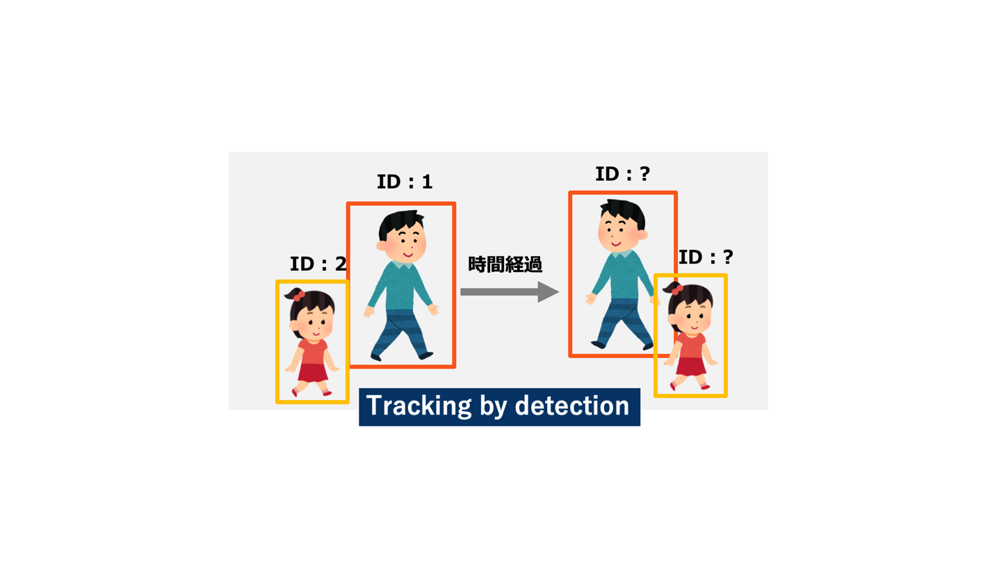

図1. Tracking by detectionの模式図

Tracking by detectionの一手法としてSORT（Simple Online and Realtime Tracking）\[1\]を取り挙げ詳述する．SORTは，主に位置特徴を用いた追跡手法であり，シンプルなモデルによって高速かつ効率的な追跡を可能にしている．

SORTでは，物体検出器としてFaster R-CNNを使用している．画像中から検出された追跡対象の物体はトラックとして管理されており，トラックは座標，BBの高さとアスペクト比とそれらの速度からなるベクトルでモデル化されている．SORTは追跡中のトラックと得られた検出が同一物体である割り当て問題を解くことで追跡を実現しており，この割り当て処理をマッチングと呼んでいる．SORTにおけるマッチングは，トラックのBBと検出のBBを用いて計算されるIoUに基づいて行われる，このマッチングをIoUマッチングとよぶ．図2にIoUマッチングの模式図を示す．IoUマッチングでは，まず，トラックが保持している過去フレームにおける情報を用いて現在のフレームにおける座標の予測位置を線形予測モデルを用いて推定する．続いて，すべてのトラックの予測位置と得られた検出のIoUを計算する．そして，IoUを重みにもつコスト行列を用いてハンガリアン法によって割り当て問題を解くことでマッチングを行う．マッチングの結果割り当てられなかったトラックは削除され，割り当てられなかった検出は新たなトラックとしてIDが割り当てられる．

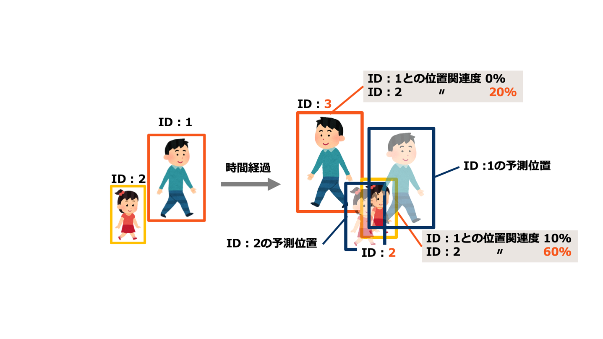

図2. IoUマッチングの模式図

2.2 複数物体追跡の問題設定：オンラインとオフライン

MOTトラッカーの処理方式は大きくオンラインかオフラインかの２つに分けることができる．オンライントラッキングは，過去から現在までのデータのみにアクセス可能な処理方式である．これに対し、オフライントラッキングは過去から現在，未来すべてのデータを用いて追跡を行う方式である．オンライントラッキングはオフライントラッキングに比べて，利用できる情報が少なく，過去から現在までのデータを用いてマッチングを行うため，未来の時点で過去の割り当てが誤りであったと判明したとしても修正することはできない．これは，社会実装において，監視カメラなどオンラインで処理する必要のあるシステムへのMOTの適用を目指した問題設定である．なお，前項で挙げたSORTはオンライントラッキング手法に分類される．

次にオフライントラッキングの既存手法について説明する．Gaoang Wangらは，外観情報に頼らずに車両のトラッキングを行う方法を提案した\[3\]．本手法のマッチング方式の概要を図３に示す．まず一段階目として，全てのフレームの検出器によって検出されたBBの位置特徴を用いて局所的なマッチングを行いトラックを作成する．その後二段階目として，断片化された局所的なトラック同士のマッチングを行なって，最終的な物体ごとのトラックを作成する．この二段階目のマッチングを大局的なマッチングと呼んでいる．本手法は，オクルージョンによって断片化されたトラックに対して大局的なマッチングを行うことによって断片化の修復を行う．このような方式はオフライントラッキングの利点である動画シーケンス全体の情報を利用したマッチング方式である．

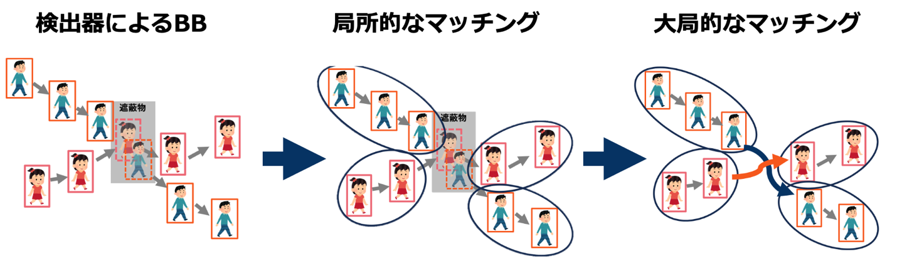

図3.文献3のトラッキング方式の概要

オンラインとオフラインを対比した際のオンライントラッカーの課題として物体の再同定があげられる．物体が遮蔽物によりオクルージョンされた際，追跡が途切れることにより，物体が再出現した場合には過去にトラックとして存在していた物体かどうかを推定する必要がある，この処理を再同定と呼ぶ．ここで，SORTは位置特徴のみでマッチングを行うトラッカーであるため，位置特徴マッチングのみで物体の長期的なオクルージョンに対して再同定を行うことは難しい．この課題を対処するため，深層学習に基づく外観特徴マッチングモジュールを採用したDeep SORT\[2\]が提案された．

2.3 深層学習に基づくオンライン複数物体追跡(Deep SORT)

前節において，オンライントラッカーにおいて物体を再同定し追跡精度を向上させる上で外観特徴を用いることは重要であることを述べた．これを踏まえ本説では，深層学習を用いた外観特徴抽出モジュールを採用したDeep SORT\[3\]について説明する．

Deep SORTは前述したSORTをベースとしたオンライントラッカーである．SORTで用いられたIoUマッチングモジュールに加え，外観特徴の類似度に基づいたマッチングカスケードと呼ばれるモジュールが採用されている．図4にDeep SORTのマッチング方式の模試図を示す．外観特徴マッチングモジュールによる外観特徴に基づくマッチングが行われた後，未割り当てのトラックとBBに対してIoUマッチングモジュールが適用される．このIoUマッチングモジュールはSORTと同様である．

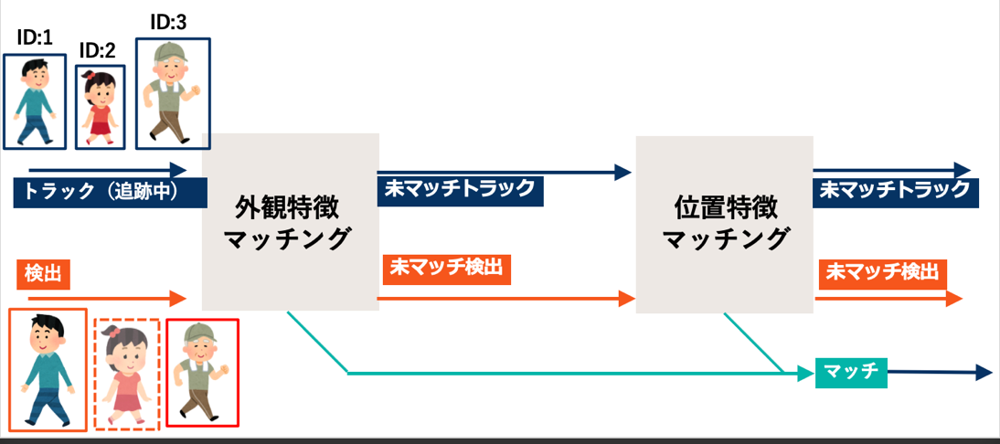

図4. Deep SORTのマッチング方式

ここで，Deep SORTにおける外観特徴マッチングモジュールと位置特徴マッチングモジュールの課題について述べる．まず，外観特徴マッチングモジュールにおける課題は，外観特徴の抽出がBBから行われることに起因する．図5に示すように，BBによって切り取られた画像には検出された物体以外にも背景が含まれる．これによって，外観特徴を切り取られた画像から抽出する際に実際の物体の外観特徴以外の特徴が含まれてしまう．特に，密集度の高いシーンにおいては，BB同士が重なる場合が多く存在する．BBが重なる場合には抽出される特徴には他の物体の外観特徴も混入されてしまうので，外観特徴によるマッチングの精度と信頼性を低下させる．

図5. BB内に抽出対象以外の物体が入り込む模式図．

次に，位置特徴に関する課題を述べる．Deep SORTではSORTと同様に線形予測に基づくカルマンフィルタが適用されている．つまり，物体の推定位置は線形で予測されている．図6に示すように，この予測機構では物体が非線形な移動を行う際には予測の精度が低下し，IoUマッチングの精度の低下につながる．特に，物体の密集度の高いシーンではその動きが非線形でかつ変動しやすくなるため，線形予測モジュールによる予測ではマッチング精度が低下すると考えられる．また，遮蔽物の背後を移動する物体は線形予測では正確な位置を予測することは困難である．

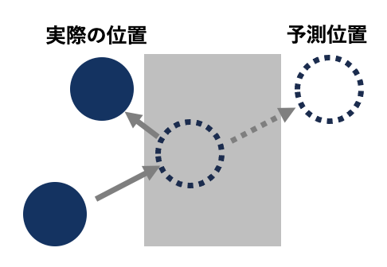

図6. 線形予測で物体の位置を予測できない場合の模式図．

このように，Deep SORTには外観特徴と位置特徴のそれぞれにおいて課題が存在しており，どちらも密集度の高いシーンで特に精度が低下することが考えられる．本論文では，位置特徴マッチングに焦点を当て，密集度の高いシーンにおけるマッチング精度を向上させ，IDスイッチを抑制することを目的とする．

# 提案手法（Motion SORT）

### 3.1 ベースモデル（Deep SORT）

提案手法のトラッキング方式はDeep SORTの方式をベースとしているため，まずDeep SORTのトラッキング方式について述べる．

### **3.1.1 Tracking by detectionの定式化**

Tracking by detectionにおいては，フレーム$t$において検出器によって検出されたBBの集合を$\mathcal{O}_{t}$とする．また，それぞれのBBを$o_{t}^{i} \in \mathcal{O}_{t}$とする． ここで，$o_{t}^{i}$が持つ情報をベクトル$d_{j} = (u,\, v,\,\gamma\,,\, h)$で表現し，$(u,v)$はBBの中心座標，$\gamma$はBBのアスペクト比，$h$はBBの高さを表す．

一方，フレーム$t$において追跡器が保持しているトラックの集合を$\mathcal{T}_{t}$とする．また，それぞれのトラックを$T_{t}^{i} \in \mathcal{T}_{t}$とする．$T_{t}^{i}$が持つ情報は８次元のベクトル$y_{i} = \left( u,\, v,\,\gamma\,,\, h,\,\dot{\, u}\,\,,\,\dot{v}\,\,,\,\dot{\gamma}\,\,,\,\dot{h}\, \right)$で表現される．ここで，$\left( \dot{u},\dot{v},\dot{\gamma},\dot{h} \right)$は各変数の速度を表す．また，$y_{i}$を用いた予測ベクトルを$\widehat{y_{i}}$とする．

追跡器はこれらの情報を用いてマッチングを行う．マッチングは集合$\mathcal{O}_{t}$と$\mathcal{T}_{t}$の要素の割り当て問題として定式化される．次項でDeep SORTの一段階目マッチングであるマッチングカスケード（外観特徴マッチング）について説明する．

### **3.1.2 マッチング・カスケード（外観特徴マッチング）**

マッチング・カスケードにおいて，追跡器が保持しているトラック$\mathcal{T}_{t}$とフレーム$t$において検出されたBBである $\mathcal{O}_{t}$に対してマッチングが行われる．このマッチングは，より最近観測されたトラックを優先的にマッチングさせる工夫がなされている．そのため，トラックには年齢が定義されており，時刻が進むに応じて１ずつ加算される．なお，事前に定義された最大年齢を超えるとトラックはシーンから離脱したとみなされ削除される．マッチング・カスケードでは，年齢の小さいトラックから順に割り当てを行うことにより優先度に基づいたマッチングが実現される．

マッチング・カスケードにおける割り当て問題はハンガリアン法によって解かれる．ハンガリアン法で用いる重みは，位置特徴に基づく距離と外観特徴に基づく距離の２つの重みの線形和で表される．位置特徴に基づく重みはマハラノビス距離である．一方，外観特徴に基づく重みは，外観特徴を表現するベクトルである外観特徴識別子の内積によって定義された距離である．そして，各重みに対して確率分布に基づく信頼性を考慮した閾値処理を施したものをハンガリアン法で用いる．以下で重みの定式化について述べる．

フレーム$t$におけるマッチング・カスケードでは，最大年齢を超過していない全ての過去フレームのトラック$\mathcal{T}_{k}\ (t - maxage < k \leq t)$とフレーム$t$の検出BB $\mathcal{O}_{t}$ が与えられる．ここで，集合$\mathcal{O}_{t}$と$\mathcal{T}_{t}$の要素の割り当て問題を解くことを考える．$i$ 番目の検出BB $o_{t}^{i} \in \mathcal{O}_{t}$ と$j$ 番目のトラック $T_{t}^{i}$ の位置特徴に基づく重みを$d^{(1)}(i,j)$とし，外観特徴に基づく重みを$d^{(2)}(i,j)$とする．また，確率分布に基づく信頼性を考慮した閾値処理を行うための割り当てインジケータそれぞれ$b^{(1)}(i,j)$，$b^{(2)}(i,j)$とする．

まず，$d^{(1)}(i,j)$について述べる．トラック$T_{t}^{i}$の予測ベクトル$\widehat{y_{i}}$と検出BB $o_{t}^{j}$のベクトル$d_{j}$とのマハラノビス距離を用いてトラック$T_{t}^{i}$と検出BB $o_{t}^{j}$の重み$d^{(1)}(i,j)$を定式化する．重み$d^{(1)}(i,j)$は共分散行列$S$用いて以下のように定義される．

$$\begin{array}{r}
d^{(1)}(i,j) = \left( d_{j} - \widehat{y_{i}} \right)^{T}S_{i}^{- 1}\left( d_{j} - \widehat{y_{i}} \right)\#(1)
\end{array}$$

ここで，$d^{(1)}(i,j)$に対して確率的な信頼性を考慮した閾値処理により，可能性の低い割り当てを除外する処理を行う．具体的には，逆$\chi^{2}$分布から計算される95%信頼区間を用いて閾値処理を行い，割り当てインジケータ$b^{(1)}(i,j)$を計算する．インジケータ$b^{(1)}(i,j)$は以下のように定義される．

$$\begin{array}{r}
b_{i,j}^{(1)} = 1\left\lbrack d_{(i,j)} \leq t^{(1)} \right\rbrack\#(2)
\end{array}$$

このインジケータは，$i$番目のトラックと$j$番目の検出の結びつけが信頼性の観点で許容される場合に1，そうでない場合に0となる．

次に，外観特徴に基づく距離$d^{(2)}(i,j)$について述べる．トラック $T_{t}^{i}$には外観特徴識別子の集合$R_{i}$が関連づけられている．集合$R_{i}$のうち$k$番目の特徴識別子を$r_{k}^{i} \in R_{t}$とする． マッチングによってトラック $T_{t}^{i}$ に紐づけられたBBに対してCNNを用いた特徴抽出を行うことで外観識別子$r_{k}^{i}$ が計算される．なお，各トラックは，直近の100個の外観記述子を持つこととする． トラック$\ T_{t}^{i}$ と検出BB $o_{t}^{j}$の距離$d^{(2)}(i,j)$は以下のように定義される．

$$\begin{array}{r}
d^{(2)}(i,j)\, = \,\min\,\text{\{}1\, - \, r_{j}^{T}\, r_{k}^{(i)}\,\left| \, r_{k}^{(i)}\,\ {\in R}_{i}\, \right\}\#(3)
\end{array}$$

位置特徴に基づく重み同様に，$d^{(2)}(i,j)$に対してもインジケータ$b^{(2)}(i,j)$を定義する．

$$\begin{array}{r}
b_{i,j}^{(2)} = 1\left\lbrack d^{(2)}(i,j) \leq t^{(2)} \right\rbrack\#(4)
\end{array}$$

ハンガリアン法で用いる重み$c_{i,j}^{(1)}$は，$d^{(1)}(i,j)$と$d^{(2)}(i,j)$の線形和を用いる．重み$c_{i,j}^{(1)}$は変数$\lambda$を用いて以下のように定義される．

$$\begin{array}{r}
c_{i,j} = \lambda d^{(1)}(i,j) + (1 - \lambda)d^{(2)}(i,j)\#(5)
\end{array}$$

この重み$c_{i,j}^{(1)}$は確率的な許容を表したインジケータ$b_{i,j}$を用いて閾値処理される．具体的には，インジケータ$b_{i,j}$が0であればその割り当てに関する重みを無限とすることで，インジケータを重み$c_{i,j}$に反映する．インジケータ$b_{i,j}$は$b^{(1)}(i,j)$と$b^{(2)}(i,j)$を用いて以下のように定義される．

$$\begin{array}{r}
b_{i,j} = \prod_{m = 1}^{2}b_{i,j}^{(m)}\#(6)
\end{array}$$

文献\[2\]では，式(5)について，$\lambda = 0$に設定することが妥当な選択であると述べられている．この設定は，コストにおいて外観特徴のみが使用されていることを意味する．本研究においても同様に$\lambda = 0$を採用し，本マッチング・カスケードを外観特徴マッチングと呼ぶ．

### **3.1.3 IoUマッチング（位置特徴マッチング）**

IoUマッチングでは，一段階目の外観特徴マッチングによってマッチングが行われなかったトラック$\mathcal{T}_{k}\ (t - maxage < k \leq t)$とフレーム$t$の検出BB $\mathcal{O}_{t}$を用いてマッチングを行う．IoUマッチングにおいても外観特徴マッチング同様にマッチングをトラック$\mathcal{T}_{k}$と検出BB $\mathcal{O}_{t}$の割り当て問題として定式化される．IoUマッチングでは割り当て問題をハンガリアン法で解く際にIoUに基づく重みを用いる．面積を与える関数をarea(・ )として，トラック$\ T_{t}^{i}$ と検出BB $o_{t}^{j}$の重み$c_{i,j}^{(2)}$を以下のように定義する．

$$\begin{array}{r}
c_{i,j}^{(2)} = \frac{area\left( T_{t}^{i} \cap O_{t}^{j} \right)}{area\left( T_{t}^{i} \cup O_{t}^{j} \right)}\#(7)
\end{array}$$

### 3.2 Motion matching

提案手法では，Deep SORTにおける二段階のマッチングの二段階目であるIoUマッチングの前に“Motion matching“と名付けたマッチングを行う．Motion matchingでは，追跡中のトラックと猶予中のトラックのマッチングを行う．猶予中のトラックとは，新たに検出された物体を新規に追跡する際に，最初の３フレームの間だけ暫定的なトラックとして追加されたトラックのことである．猶予中のトラック群には，過去フレームで追跡されていた追跡中 のトラックと同一の物体が適切にマッチングされずに新規のトラックとして割り当てられたものが含まれている可能性がある．従って，追跡中のトラックと猶予中のトラックの対応表にはIDスイッチの発生により分断された本来は１つのトラックであるペアが含まれる可能性がある．提案するMotion Matchingの目的は，このような適切にマッチングされなかった猶予中のトラックを追跡中のトラックと結びつけることで，単一のトラックとして修復することによりIDスイッチの発生を抑制する．

次に，Motion matchingの具体的なマッチング方式について述べる．図7にMotion matchingのマッチング方式の概要図を示す．Motion matchingは以下に示す３つのstepによって実現される．

> \[Step.1\] 追跡中のトラックと猶予中のトラックの類似度に基づく対応表を作成．
>
> \[Step.2\] 下流のマッチング方式である位置特徴マッチングによって猶予中のトラックと検出BBをマッチング．
>
> \[Step.3\] Step.1で作成した対応表を参照し，追跡中のトラックと検出をマッチング．

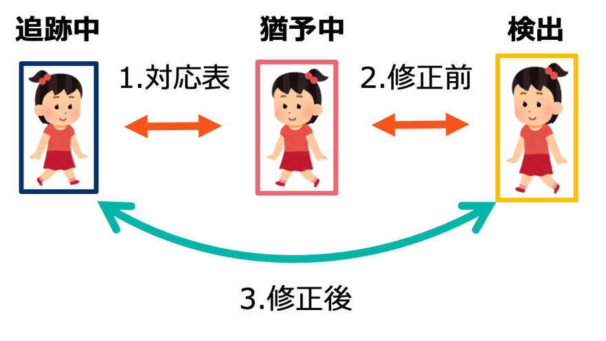

図7. Motion matchingのマッチング方式の概要図．

Step.1 では，追跡中のトラックと猶予中のトラックの類似度として，トラックの速度ベクトルのコサイン類似度が用いられる．この類似度を重みとして用いたハンガリアン法によって割り当て問題を解くことにより対応表を作成する．以下でMotion Matchingで用いる重みの定式化について説明する．

このMotion Matchingは外観特徴マッチングの後に行われるため，マッチングの対象となるトラックは外観特徴マッチングでマッチングされたなかった追跡中の未マッチトラックである．この未割り当ての追跡中のトラック全体の集合を$T_{tra}$とし，未割り当ての猶予中のトラック全体の集合を$T_{tent}$とする．$i$番目の追跡中のトラックの速度ベクトルを$v_{tra}^{i} \in T_{tra}$とし，$j$番目の猶予中トラックの速度ベクトルを$v_{tent}^{j}{\in T}_{tent}$とする．コサイン類似度を与える関数を$\text{cossim}( \cdot , \cdot )$とすると，両トラックの類似度$M_{i,j}$は以下のように定義される．

$$\begin{array}{r}
M_{i,j} = {\text{cossim}\left( v_{tra}^{i},\, v_{tent}^{j} \right)}\#(8)
\end{array}$$

### 3.3 Social-LSTMを用いた社会性を考慮した位置予測

Deep SORTにおいては，位置予測をカルマンフィルタによる線形予測で行っていた．この予測機構の課題は，物体が非線形な移動を行う際には予測の精度が低下し，IoUマッチングの精度の低下につながることであった．特に，物体の密集度の高いシーンでは人物の動きが非線形でかつ変動しやすくなるため，線形予測ではマッチング精度が低下していた．この問題を解決するため提案手法では，適用対象物体を人物に限定した上で，複数人物が持つ移動の社会性を考慮した位置予測を行う．社会性を考慮した移動としては，家族や友人などの社会的な関係を持っている場合には協調して移動する現象や，人と人が接近した際には衝突せずに避けて移動するといったことが挙げられる．

人の社会性を考慮した位置予測を行うために，位置予測モジュールとしてSocial-LSTMを採用した．Social-LSTMは人の社会性に基づく相互作用を考慮した軌道予測モデルである．長期短期記憶（LSTM）ネットワークは，リカレントニューラルネットワーク（RNN）の一種でシーケンスデータの前後の依存関係の強く，時系列データやテキストデータの処理に特化している．

ここで，軌跡予測の問題設定の定式化を行う．図8に軌跡予測モデルが扱う問題設定の概要を示す．動画シーケンスにおいて時刻$t$に登場する人物の集合を$\mathcal{O}_{t}$として，$i$番目の人物を$o_{t}^{i} \in \mathcal{O}_{t}$とする．ここで，$o_{t}^{i}$には画像上での座標$\left( x_{t}^{i},y_{t}^{i} \right)$が紐づけられている．軌跡予測モデルは時刻 $t$ までの座標の系列$\left( x_{1}^{i},y_{1}^{i} \right),\ldots,\left( x_{t}^{i},y_{t}^{i} \right),$を入力として受け取り，$\left( x_{t + 1}^{i},y_{t + 1}^{i} \right)'$を予測値として出力する．

次にSocial-LSTMによる軌道予測について説明する．図9にSocial-LSTMによる軌道予測の概要を示す．Social-LSTMでは一つの物体に対して一つのLSTMモデルを対応させており，$i$番目のLSTMは標の系列$\left( x_{1}^{i},y_{1}^{i} \right),\ldots,\left( x_{t}^{i},y_{t}^{i} \right),$を入力として受け取り，$\left( x_{t + 1}^{i},y_{t + 1}^{i} \right)'$を予測値として出力する.

さらに，Social-LSTMでは物体同士の相互作用をモデル化するために，LSTM同士が情報を共有するための工夫が行われている．各LSTMは近傍の物体を担当するLSTM同士で内部状態を相互に共有することで，物体同士の相互作用を考慮した座標の予測を行うことを学習する．

なお，Social-LSTMは，位置予測を行うためにトラックの過去の軌跡の座標の系列からサンプリングを行い入力として用いる．サンプリングを行う際の変数として個数$f_{N}$とインターバル$f_{I}$を設定した．$f_{N}$は個々の物体からいくつ軌跡をサンプリングするかを決定する変数であり，$f_{I}$は軌跡のうちいくつおきにサンプリングを行うかの変数である．

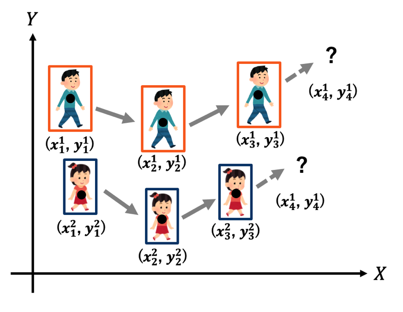

図8. 軌跡予測モデルが扱う問題設定の概要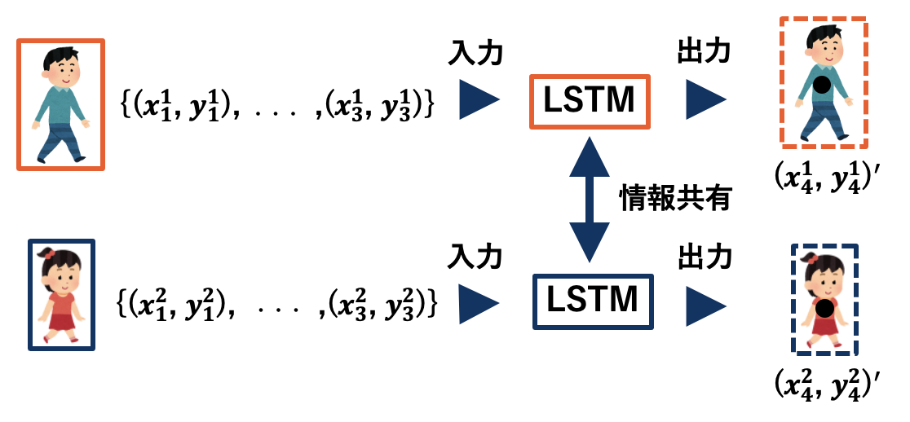

図9. Social-LSTMによる軌道予測の概要

### 3.4 オクルージョンに起因するBBサイズの変化抑制

ベースモデルであるDeep SORTでは，オクルージョンが発生した際にBBのサイズが不正確に変化する現象が見られた．例として，図10にオクルージョンによってID:2のBBサイズが不正確に変化する様子を示す．この現象は，背景や他の物体によるオクルージョンにより，視認される外観サイズの縮小に起因する．検出器による縮小したBBの検出は，線形予測によって増幅され，実際の物体サイズとのずれが大幅に増加することによってBBサイズの不正確な変化が発生する．この不正確なBBサイズの変化はIoUマッチングの失敗につながる． Motion MatchingはIoUマッチングによるマッチングをトリガーとして修正が行われるため，本手法の精度を向上させるためには，正確なIoUマッチングが不可欠となる．従って，BBサイズの不正確な変化を抑制する必要がある．

提案手法では，BBサイズは急激には変化しないという仮説のもと，予測サイズを現在のフレームを用いて平均化することにより，BBサイズの急激な変化を抑制する．この変化抑制は，トラック $T_{t}^{j}$のサイズ $s_{i}^{t}\, = \,(\gamma,\, h)$ ，予測サイズ $\widehat{s_{i}^{t}}$より以下のように定義される．

$$\begin{array}{r}
\widehat{s_{t}^{i}} = \lambda s_{t - 1}^{i} + (1 - \lambda)\widehat{s_{t}^{i}}\#(9)
\end{array}$$

なお，$\lambda$は変化抑制の強度調整に関するパラメータである．

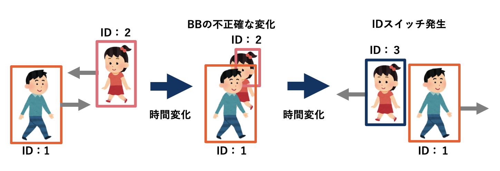

図10. BBサイズが不正確に変化する様子の模式図

### 3.5 外観特徴マッチングにおける閾値の厳正化

提案手法では，外観特徴マッチングにおける割り当ての重みづけに適用される閾値を文献\[2\]で用いられていたものより高く設定することにより，外観特徴によるマッチングの信頼度を向上させた．図11に示すように，Motion Matchingモジュールは外観特徴マッチングモジュールの下流に存在する．よって，外観特徴マッチングの精度を厳正化することにより，外観特徴の類似度が低いものをマッチングさせずに，後段の位置特徴マッチングとMotion Matchingによってマッチングを行う．これにより，外観特徴マッチングにおいて信頼性が低いマッチングを避けMotionマッチングで信頼性の高いマッチングを行うことが可能となる．

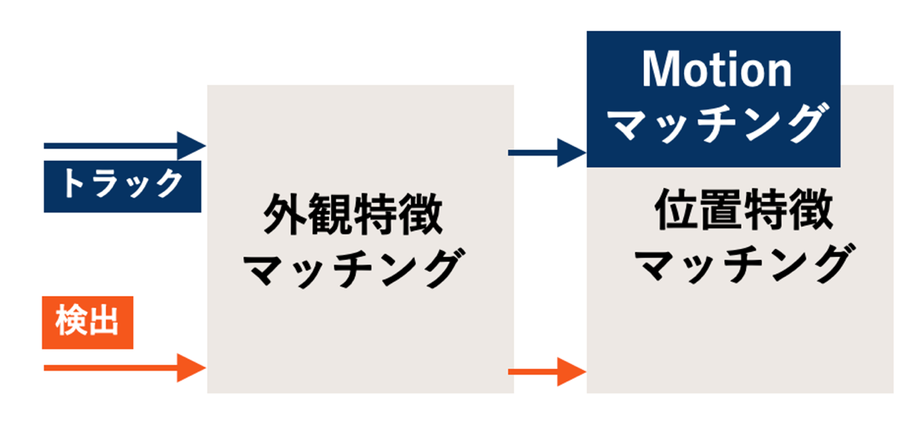

図11. マッチング方式の概要図

# 実験と考察

### 4.1 実験条件

### **4.1.1 データセットとメトリクス** 

実験には，MOT16 Challengesデータセット\[5\]を用いる．これは，MOTの標準的なベンチマーク用のデータセットである．Ground truthが公開されている６つの真値付きの動画シーケンスを利用して実験を行う．図12にMOT16 Challengesデータセットに含まれるいくつかの動画シーケンスを示す．データセットには画角や移動の方向，カメラが移動するか固定か等の多様性の高い動画データが含まれる．

評価指標として， MOTA（Multiple Object Tracking Accuracy）とIDSW(ID SWitch)を使用する．MOTAはFP（False Positive）, FN（False Negative）, IDSWに基づいて計算される．FPは誤って検出された物体の数を表す．つまり，実際には存在しないが，モデルが存在していると誤って認識したオブジェクトのことである．これに対して、FNは、実際に存在するがモデルによって検出されなかった物体の数を指す．IDSWは、動画シーケンス全体のIDスイッチの回数であり，トラッキングの一貫性を評価するために使用される．MOTAは，これらの要素を組み合わせた総合的な評価であり，以下の式で表される．

$\begin{array}{r}
MOTA = 100 \times \left( 1\  - \ \frac{FP\  + \ FN\  + \ IDSW}{g} \right)\#(10)
\end{array}$

ここで，$g$はモデルによって動画シーケンスでIDが割り当てられたBBの総数である．

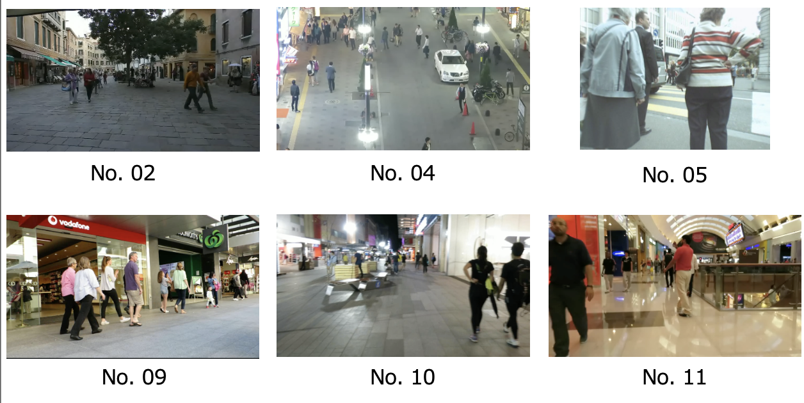

図12. MOT16 Challenges データセットに含まれる動画シーケンス

### **4.1.2 実装の詳細**

深層学習を用いた外観特徴抽出器には，文献\[2\]と同様に事前に1261人の歩行者の1,100,000枚以上の画像を含む大規模な人物再識別データセット\[6\]で訓練されたCNNを採用した．

Social-LSTMに用いたLSTMは，文献\[4\]と同様に人間の軌跡のデータセットであるETH\[7\]とUCY\[8\] を使用して学習させた．ETHデータセットは750人の歩行者が現れる２つのシーンを含み，UCYデータセットは786人の歩行者が現れる２つのシーンを含んでいる．

Social-LSTMにおけるフーレム入力に関する変数であるフレームの個数$f_{N}$とフレーム同士のインターバル$f_{I}$は，パラメータ探索の結果として$f_{N} = 3$，$f_{I} = 15$とした．

### 4.2 ベースモデル Deep SORTとの比較実験

この実験では，提案手法のベースモデルであるDeep SORT\[2\]と提案手法との比較実験を行った．ベースモデルとの比較結果を表１に示す．No.02, No.04, No.05, No.09, No.10, No.11は動画シーケンスの番号を表しており，表の値は各動画シーケンスで発生したIDスイッチの回数である．また，IDSWはこれらの合計値である．結果より，MOTAとIDSWの両方のメトリクスに関して提案手法はベースモデルよりも高精度に追跡できていることを確認した．

表１. ベースモデルとの比較実験結果

| 動画シーケンス | No.02  | No.04 | No.05 | No.09 | No.10 | No.11 | IDSWの合計 | MOTA |
|----------------|--------|-------|-------|-------|-------|-------|------------|------|
| ベースモデル   | **15** | 43    | 40    | 28    | 23    | 23    | 172        | 30.5 |
| 提案手法       | 19     | 45    | 45    | 24    | 14    | 18    | 164        | 30.6 |

### 4.3 アブレーション実験

提案手法はベースモデルに対して複数のモジュールの追加と変更を適用しているため，アブレーション実験を行うことでより詳細なモデルの解析を行った．アブレーション実験の結果を表2に示す．MOT16 Challengesデータセット\[5\]における各動画シーケンスにおけるIDSWを比較した．アブレーション実験の結果から，全てのモジュールの追加と変更を適用した提案手法が組み合わせの内で最もIDSWの合計値が低いことが示された．

一方，ほとんどの動画シーケンスでMotion matchingを用いた場合，用いない場合と比べて精度が向上しており，特に動画No.05において大幅に精度が向上している．この動画シーケンスではオクルージョンが多く発生しており，Motion matchingはオクルージョンの多いデータにおいて特に有効な手法であることを示した．オクルージョンが多いデータではトラックが断片化する可能性が高く，Motion matchingによるトラックの修復作用がIDスイッチを抑制したと考えられる．

Social-LSTMを用いた予測モジュールを用いた場合，用いない場合に対して特に動画No.04において精度が向上している．この動画シーケンスは俯瞰の視点で撮影されたものであり，俯瞰における位置予測に対して予測モジュールが効果的にIDスイッチを削減している．一方で，動画No.05やNo.09においては、Social-LSTMによる位置予測では，線形予測と比較してIDスイッチが増加している．これらの動画シーケンスは横からの視点で撮影されたものである．よって，Social-LSTMは横からの視点ではうまく軌道予測ができていないと考えられる．これは，Social-LSTMの学習データが俯瞰データに限られていることに起因すると考えられる．

表2. アブレーション実験の結果

| 動画シーケンス       |     |     |     |     | No.02  | No.04 | No.05 | No.09 | Np.10 | No.11 | 合計IDSW |
|----------------------|-----|-----|-----|-----|--------|-------|-------|-------|-------|-------|----------|
| ベースモデル         | ×   | ×   | ×   | ×   | **15** | 43    | 40    | 28    | 23    | 23    | 172      |
| Motion Matching      | ×   | ○   | ○   | ○   | 19     | 45    | 50    | 26    | 17    | 18    | 175      |
| BBサイズ変化抑制     | ○   | ×   | ○   | ○   | 19     | 45    | 42    | 26    | 17    | 18    | 167      |
| 外観特徴の閾値厳正化 | ○   | ○   | ×   | ○   | **15** | 42    | 41    | 31    | 21    | 23    | 173      |
| Social-LSTM          | ○   | ○   | ○   | ×   | 20     | 48    | 39    | 24    | 16    | 18    | 165      |
| 提案手法             | ○   | ○   | ○   | ○   | 19     | 45    | 45    | 24    | 14    | 18    | 164      |

ベースモデルと提案手法との比較実験において，実際にIDスイッチを抑制した例を示す． 図13では，ベースモデルにおいて IDが5から96に変化しており，図14ではベースモデルではIDが1から5に変化しており，図15では，ベースモデルではIDが6から44に変化している．これらの例では，人物同士のオクルージョンによってIDスイッチが発生している．一方，提案手法ではいずれの例でもIDスイッチを抑制していることがわかる．

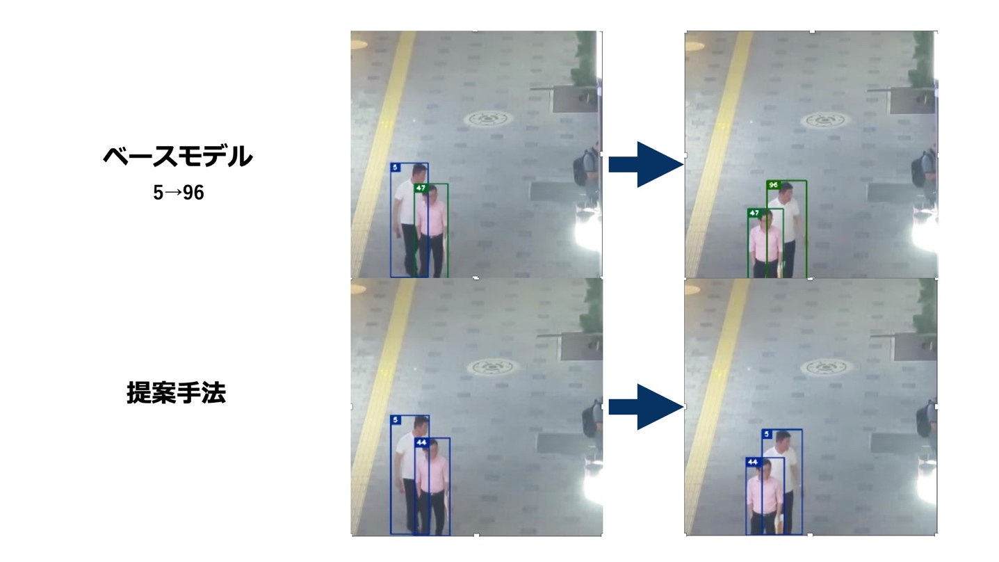

図13. 提案手法によってIDスイッチを抑制した例1

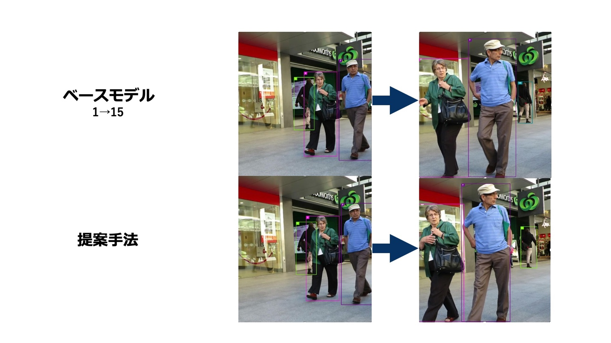

図14. 提案手法によってIDスイッチを抑制した例2

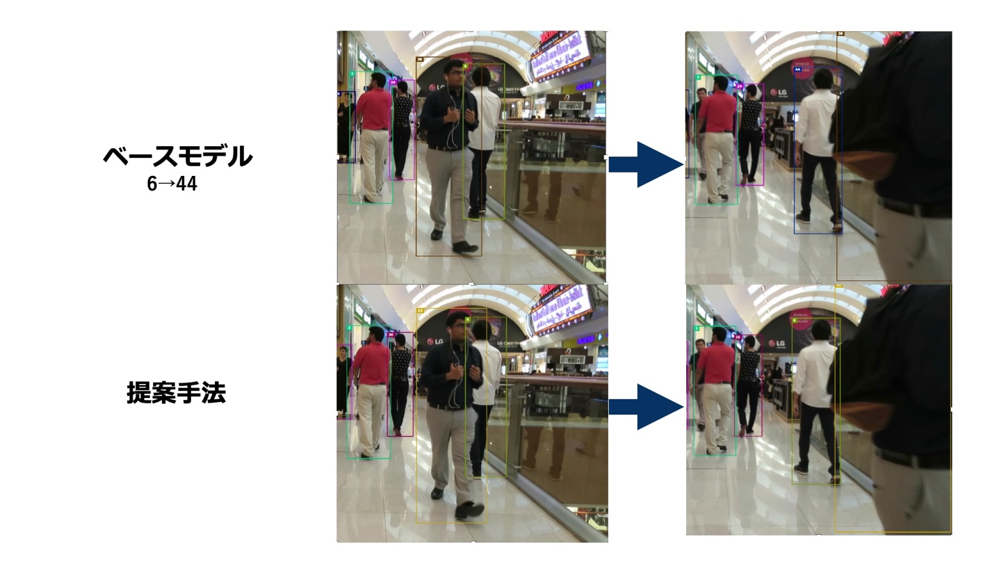

図14. 提案手法によってIDスイッチを抑制した例3

# 結論

本研究では，Deep SORT\[2\]をベースとして，位置特徴マッチングを改良したMotion SORTを提案した．本研究の提案手法は，MOT16 Challenges データセット \[5\]において，ベースモデルのDeep SORT\[2\]に対してMOTAとIDスイッチの削減の観点から性能が向上したことを示した．今後の展望としては外観特徴マッチングに工夫を加えることが考えられる．提案手法では主に位置特徴に対して工夫を行い新規手法を提案した．したがって，外観特徴マッチングにおける課題は未だ残されている．例えば，外観特徴の抽出の際に他の物体の特徴が入り込む問題に対しては，セグメンテーション を使用することで抽出された外観特徴の厳密性を向上させて対処する手法が考えられる．

# 謝辞

本研究を進めるにあたり，全過程を通じて御助言，御指導を頂きました，滝本准教授に深く感謝致します．

また，本研究及び本論文の執筆において，様々な面で御協力を頂きました，金川教授に感謝致します．

そして，本研究を通して日頃から議論や協力をいただいた数理メディア情報研究室の皆様に御礼申し上げます．

私の心身の支えを，金銭的あるいは直接的に行なっていただいた，父と母と祖父母そして愛猫に感謝申し上げます．

# 参考文献

| \[1\] | SORT |
|----|----|
| \[2\] | Deep SORT |
| \[3\] | Track without Appearance: Learn Box and Tracklet Embedding with Local and Global Motion Patterns for Vehicle Tracking |
| \[4\] | Social-LSTM |
| \[5\] | Deep SORT の外観特徴学習データセット |
| \[6\] | MOT16 Challenge Dataset |
